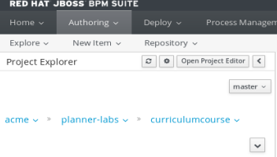
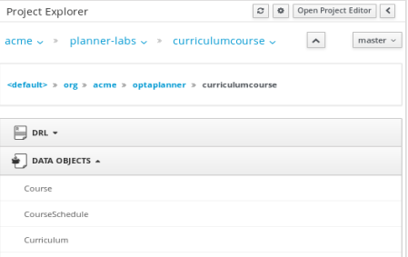
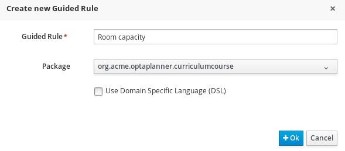
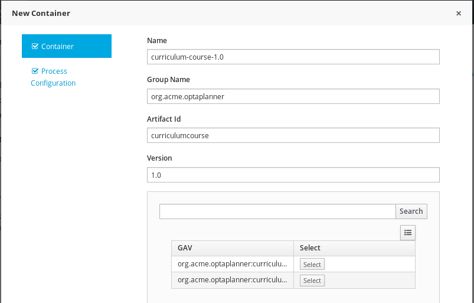
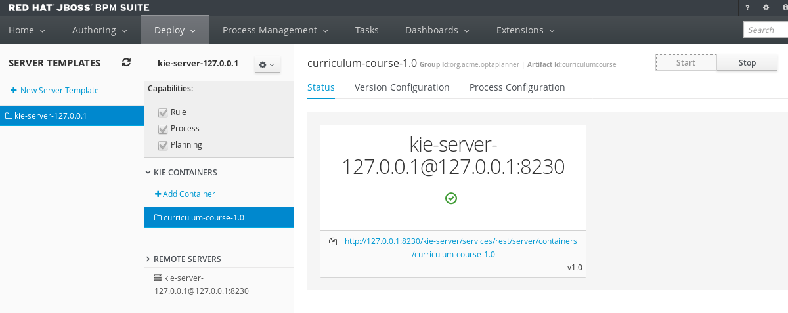

# 1. Resource Planner Laboratory Instructions
## 1.1. Goals
* Use Resource Planner authoring tools within Business Central.
* Deploy a Resource Planner project in the KIE Server.
* Use the KIE Serer REST API to solve a problem configuration.

In this activity we will leverage the Resource Planner workbench to solve a curriculum course scheduling problem. The problem definition model will look like the following diagram:


This is a real world example that deals with scheduling of lectures in an university. It was presented by the International Timetabling Competation in 2007. You can find more information in the [competition web site](http://www.cs.qub.ac.uk/itc2007/curriculmcourse/course_curriculm_index.htm).

The main idea of this problem is to assign university lectures to rooms with different capacities and to assign them in a specific time period: By period we refer to a fixed size time range in a day of the week like: `Friday from 9 to 10 AM`.

To describe the lecture content we have other entities:
The `Course` represents the different courses that the university offers like Mathematics, Physics or Biology. Each `Course` has an specific number of students who entered the `Course`. Every `Course` can be represented in multiple instances that are known as `Lectures`. It is possible to one `Teacher` to teach a multiple number of courses. There is also the concept of `Curriculum`, which represents a group of courses with the same focus: there can be for example a _scientific curriculum_ that could contain courses like physics, chemistry and biology courses among others to support that curriculum; in the other hand _humanities curriculum_ would offer courses like arts and humanities.
This is a constraints satisfaction problem with multiple restrictions that need to be taken into account. We call them **HARD CONSTRAINTS** and **SOFT CONSTRAINTS**.

The **HARD CONSTRAINTS** that _can't be broken by any means_ are for example:
* A teacher can't teach 2 lectures at the same time.

The **SOFT CONSTRAINTS** are not necessarily mean to be met, but _they influence the quality of the solution_. For example:
* The lectures of the same course should be assigned to a single room.

The summarized problem definition gathered in the [Resource Planner documentation](https://access.redhat.com/documentation/en-us/red_hat_jboss_brms/6.4/html/business_resource_planner_guide/usecasesandexamples#curriculumcourse) is:

Problem Description:
Schedule each lecture into a timeslot and into a room.

Hard constraints:
* Teacher conflict: A teacher must not have 2 lectures in the same period.
* Curriculum conflict: A curriculum must not have 2 lectures in the same period.
* Room occupancy: 2 lectures must not be in the same room in the same period.
* Unavailable period (specified per dataset): A specific lecture must not be assigned to a specific period.

Soft constraints:
* Room capacity: A room’s capacity should not be less than the number of students in its lecture.
* Minimum working days: Lectures of the same course should be spread out into a minimum number of days.
* Curriculum compactness: Lectures belonging to the same curriculum should be adjacent to each other (so in consecutive periods).
* Room stability: Lectures of the same course should be assigned the same room.

## 1.2. Activity Prerequisites
* Installation and configuration of the rhte-process-driven-apps.vdi ([read instructions](vdi_installation.md)).
* Business Central and KIE Server EAP instances up and running in the rhte-process-driven-apps virtual machine.
* `Acme` organizational unit created in the Business Central.

# 2. Setup Activity Environment
If at any point you get stuck with the development lab instructions or if you are only interested with looking at the deployment and working solution of this project: go directly to [4.2. Deploying to unmanaged KIE Server].

## 2.1. Enable Resource Planner Authoring and Runtime
Resource Planner is included in the JBoss BPM Suite distribution for Business Central and KIE Server.
In this section we will review the required instructions to enable authoring and run time for the Resource Planner.

1. Open a terminal window and change to the business central EAP instance configuration folder and edith the `application-roles.properties` file:
  ```bash
  cd ~/lab/bpms/bc/standalone/configuration
  pluma  application-roles.properties
  ```
2. add the `plannermgmt` role to the `jboss` user and save the file:
  ```
  jboss=admin,analyst,user,kie-server,rest-all,plannermgmt
  ```
3. Login as `jboss/bpms` in business central by navigating to `http://localhost:8080/business-central`.
4. Clone the `planner-labs` git repository in business central:
  1. Select the **Authoring**>**Administration** menu option.
    
  2. From the **Repositories** menu select the **Clone repository** option.
    
  3. Fill the _Clone Repository_ form with the follosing information:
    * **Repository Name:** planner-labs
    * **Organizational Unit:** acme
    * **Git URL:** https://github.com/gpe-mw-training/planner-labs.git
    * Leave empty the `user name` and `password` (planner-labs is a public repository).
5. Check that the authoring for Resource Planner have been enabled:
  1. Select the **Authoring**>**Project Authoring** menu option.
    
  2. Click on the **New Item** menu and check that the `Solver configuration` option is present:
    
  > If the option is not enabled log out and log in to Business Central, also double check the roles configuration for the `jboss` user.

6. Open a terminal window and review the configuration switch for the `optaplanner extension`:
  ```bash
  cat ~/lab/bpms/kieserver/bin/standalone.conf | grep optaplanner
  ```
2. You should see a `false` value for the disable optaplanner switch:
  ```
  JAVA_OPTS="$JAVA_OPTS -Dorg.optaplanner.server.ext.disabled=false"
  ```
> If you see a `true` value: Edith the standalone.conf file, change the value to `false` and restart the KIE-Server EAP instance.

3. Open the API endpoints list in your browser by navigating to: http://localhost:8230/kie-server/docs
  * Search for the `solver` endpoints:
    
  > If you are unable to find the solver endpoints, double check the kieserver `standalone.conf` extension disable value and restart the kieserver EAP instance; There is a common mistake to edit the `standalone.conf` from the business central EAP instance instead of the KIE Server one, check that this is not your case.

# 3. Enhace the Model using Optaplanner Annotations
## 3.1. Select the project
1. Select the **Authoring**>**Project Authoring** menu option.
  
2. From the `acme` organization, select the `planner-labs` repository and the `curriculumcourse` project.
  

## 3.2. Add Optaplanner annotations


When planning the solution we identify:
* `@PlanningEntity`: The object that changes it's state during planning. In this case is the `Lecture`: Because we don't know in advance in which `Room` and time `Period` the `Lecture` will be given.
* `@PlanningVariable`: Attributes that change over the time.
* `@PlanningSolution`: Doesn't provide help in modeling the problem, it is used by Optaplanner to reference all `planning entities` and `planning facts` that are used in the solving process.

With the `curriculumcourse` project selected, these are the configuration steps to add the Optaplanner annotations on selected data objects of our project:

1. Navigate to the org.acme.optaplanner.curriculumcourse package:
  
2. Select the `CourseSchedule` Data Object and using the Optaplanner editor in the right side of the screen: Select the `Planning Solution` with `Hard Soft Score` solution score type.
  
3. From the field list of the `CourseSchedule` object: Select the `lectureList` field, and using the Optaplanner editor, activate the `Planning Entity Collection` checkbox.
  
4. Using the Optaplanner editor:
  1. Set the `periodList` field as a `Planning Value Range Provider` with the **id:** `periodRange`
  2. Set the `roomList` field as a `Planning Value Range Provider` with the **id:** `roomRange`
5. Save the `CourseSchedule` data object.
6. Select the `Lecture` Data Object and using the Optaplanner editor: Select the `Planning Entity` option.
7. Using the Optaplanner editor:
  1. Set the `period` field of the `Lecture` Data Object as a `Planning Variable` and set the **valueRangeId:** as `periodRange`
  2. Set the `room`field as a `Planning Variable` and set the **valueRangeId:** as `roomRange`
8. Save the `Lecture` data object.

## 3.3. Add Solver Configuration

1. With the `curriculumcourse` project selected, and within the org.acme.optaplanner.curriculumcourse package: Select **New item** > **Solver Configuration** menu option.
2. Name the `Solver configuration` as `curriculumCourseSolverConfig`
  
3. Set a **Spent Limit** of `1 minute` to find a solution.
4. Save and close the `curriculumSolverConfig`

## 3.4. Creating a capacity rule

If the capacity of the room is exceeded we will execute a rule to decrease the `solution score`.

1. With the `curriculumcourse` project selected, and within the org.acme.optaplanner.curriculumcourse package: Select **New item** > **Guided Rule** menu option.
2. Name the `Guided Rule` as `Room capacity`
  
3. From the `When` conditions:
  1. Add a condition for room to exists and assign the room value to a local rule variable (`$room`).
  2. Add a condition for a lecture to exists with the same room value as in previous step.
  3. Add a condition for the lecture course student size greater than the room capacity and assign the expression for the student size to a local rule variable(`$studentSize`). (**Tip:** You will use an expression editor in the Lecture when condition from _step 2_).
    * At the end of these conditions the rule should look like this:
      
4. Add a free from DRL for the `THEN` action:
  * The DRL expression for the free from DRL:
    ```java
    scoreHolder.addHardConstraintMatch(kcontext, $room.capacity - $studentSize);
    ```
  * At the end of the `THEN` action configuration, the final result for the rule should look like this:
    
5. Save the rule and close the editors.

# 4. Deploy solver solution

## 4.1. Deploying from Business Central to managed KIE Server.

1. With the `curriculumcourse` project selected: Select the **Open Project Editor** button from the `Project Explorer` header.
2. Select the `Build and Deploy` option from the `Build` command drop down in the `Project Editor`
3. You should receive confirmation of successful build.
4. Select the **Deploy** > **Execution Servers** menu option from the JBoss BPM Suite menu bar.
5. Add a new kie server container with the following values:
  * **Name:** curriculum-course-1.0
  * **Group Name:** org.acme.optaplanner
  * **Artifact Id:** curriculumcourse
  * **Version:** 1.0
    
6. Finish the container creation.
7. Start the container using the `Start` button.
  

## 4.2. Deploying to unmanaged KIE Server

The following steps are optional:
* Use them when deploying a completed solution from git repository to the KIE Server. This option would succeed if you only want to try the solution integration, but you don't want to go through the development process in Business Central.

1. Change directory to `~/lab` and clone the gitHub repository locally.
  ```bash
  cd ~/lab
  git clone https://github.com/gpe-mw-training/planner-labs.git
  ```
2. Checkout the `solved` branch.
  ```bash
  cd ~/lab/planner-labs
  git checkout solved
  ```
3. Use maven to build the component jar file.
  ```bash
  cd ~/lab/planner-labs/curriculumcourse
  mvn clean install
  ```
4. Use the KIE Server REST API to create a container based on the previously created jar.
  ```bash
  curl -X PUT -H "Accept:application/json" -H "Content-Type:application/json" --user kieserver:kieserver1! \
  -d '{"release-id":{"group-id":"org.acme.optaplanner","artifact-id":"curriculumcourse","version":"1.0"}}' \
  "http://localhost:8230/kie-server/services/rest/server/containers/curriculum-course-v1.0"
  ```
5. Confirm that the container has been created by listing the containers in the KIE Server using the REST API:
  ```bash
  curl -X GET -H "Accept: application/json" --user jboss:bpms http://localhost:8230/kie-server/services/rest/server/containers
  ```
# 5. Use the solution with the KIE Server REST API.
## 5.1. Explore the dataset
## 5.2. Invoke the REST API with the given dataset
